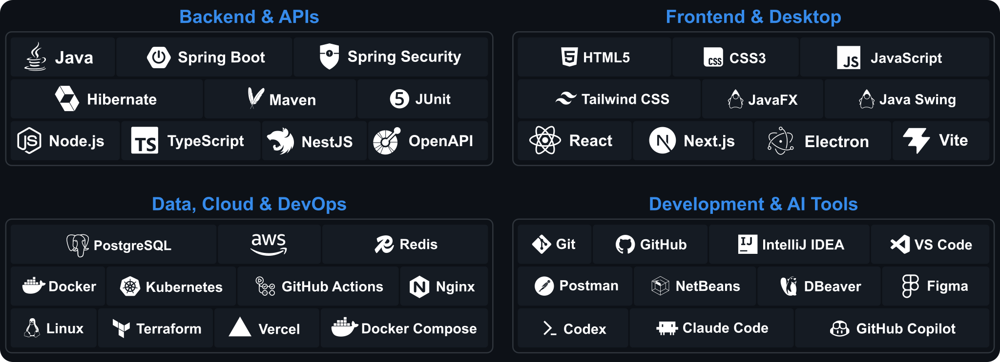
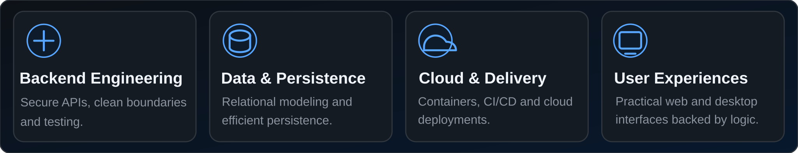

  

## Technology Stack

  

## Engineering Focus

  

## About Me

I am a Brazilian Full-Stack Developer based in Rio de Janeiro, focused on building reliable, maintainable, and scalable software.

My strongest expertise is in the Java ecosystem, where I develop backend applications and RESTful APIs with Spring. I also work across frontend development, relational databases, containerization, and cloud infrastructure from initial design to deployment.

I value clean architecture, pragmatic engineering, and continuous improvement. My goal is simple: turn complex requirements into software that is clear, efficient, and built to last.

## GitHub Activity

  

   

  
  
  

